# AI Orbit — Ingestion Pipeline Architecture

## Modular Pipeline Architecture

```mermaid
flowchart LR
    subgraph Discovery
        D1[GitHub API Source]
        D2[HuggingFace Source]
        D3[Official Directories]
    end

    subgraph Storage & Extraction
        RAW[data/raw/tools_YYYYMMDD.jsonl]
        EX[Extractor Module]
    end

    subgraph Transformation & Deduplication
        CL[Cleaner]
        NORM[URL & String Normalizer]
        DEDUP[Deduplication Resolver RapidFuzz + Domain]
    end

    subgraph Verification & Enrichment
        VER_WEB[Official Website Verifier]
        VER_LOGO[Official Logo Discovery]
        CLASS[Taxonomy Classifier]
        LLM[LLM Description Orchestrator]
    end

    subgraph Quality Gate & Storage
        GATE[Validation Gate]
        REL[Relationship Mapper]
        VAL[data/validated/tools.jsonl]
        REJ[data/rejected/tools.jsonl]
        EXP[CSV / JSON / Google Sheets Exporter]
    end

    D1 & D2 & D3 --> RAW
    RAW --> EX
    EX --> CL
    CL --> NORM
    NORM --> DEDUP
    DEDUP --> VER_WEB
    VER_WEB --> VER_LOGO
    VER_LOGO --> CLASS
    CLASS --> LLM
    LLM --> GATE
    GATE -->|Passed| REL
    GATE -->|Failed| REJ
    REL --> VAL
    VAL --> EXP
```

## Scaling Strategy (from 200 to 50,000+ Records)
1. **Asynchronous Stream Processing**: Records flow through JSONL pipelines with bounded concurrency (`asyncio.Semaphore(20)`), preventing high-memory spikes.
2. **Deterministic Identity Deduplication**: Domain + Name SHA256 hashing (`tool_<hash[:16]>`) enforces idempotency across multi-source discovery.
3. **Resilient Rate Limits & LLM Fallback**: Exponential backoff with jitter handles HTTP 429 errors. LLM provider fallback chain (Gemini Flash → Groq Llama → DeepSeek) prevents single-provider rate-limit blockages.
4. **Checkpointing**: Ingestion state stored per discovery source to allow seamless resumes.
