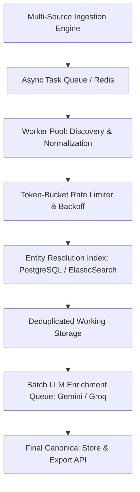

# AI Orbit — Tools Module Scale Architecture Document

## Overview

This document outlines the operational and architectural scale framework for the AI Orbit Tools dataset ingestion, qualification, entity resolution, and enrichment pipeline.

---

## 1. Scale Tiers & Current Status

| Scale Tier | Target Count | Execution Status | Primary Focus | Storage & Processing Pattern |
| :--- | :--- | :--- | :--- | :--- |
| **CURRENT BASELINE** | **50 records** | **VERIFIED GOLDEN BASELINE** | Immutability, zero hallucination, regression anchoring | In-memory JSON + Git SHA256 anchoring (`data/exports/tools.json`) |
| **PHASE 6B TARGET** | **~500 records** | **IN EXECUTION** | GitHub multi-slice discovery, qualification, deduplication, provenance tracking | Streaming JSONL candidates (`data/working/`) + Checkpoint Manager |
| **FUTURE SCALE** | **1K → 10K → 50K** | **ARCHITECTURAL CONCEPT** | High-throughput distributed ingestion & indexing | Async worker queues, token-bucket rate limiters, vector database indexing |

> [!IMPORTANT]
> **Clarification on 50K Scale**: The 50,000 entity mark is an **architectural scale model**, NOT a claim that 50,000 records have been harvested. The system design ensures that the pipeline can scale cleanly from 50 to 500 and eventually to 50,000 without architectural rewrites or breaking entity resolution integrity.

---

## 2. Immutable Golden Baseline (50 Records)

- The 50-record canonical dataset (`data/exports/tools.json`) is the **immutable golden baseline** for regression testing and quality control.
- SHA256 Checksum: `4520014c9a1676f9090be806087a92ac0e12fef3d3136a95860cff48388ff2a1`
- Baseline entities are pre-loaded into the `DeduplicationResolver` as immutable anchors before any expansion candidate processing begins. Candidate records matching baseline entities are immediately classified as duplicates.

---

## 3. Phase 6B Discovery Expansion (~500 Records)

Expansion discovery scales candidate collection using systematic GitHub API query slicing across:
1. **Star Ranges**: `stars:100..500`, `stars:501..2500`, `stars:>2500`
2. **Taxonomy & Domain Slices**: `ai-tools`, `ai-developer-tools`, `llm-tools`, `ai-agent`, `mcp`, `mcp-server`, `rag`, `vector-database`, `generative-ai`, `code-assistant`, `multi-agent`.

Key operational guarantees:
- **Resumable Checkpointing**: Granular state management tracking query label, page number, processing stage, and completed status in `data/working/expansion_checkpoint.json`.
- **Deduplication Hierarchy**: Deterministic 5-step entity resolution (exact ID → GitHub repo URL → normalized official domain → canonical name blocking → RapidFuzz candidate block comparison).
- **Legitimate Provenance**: All expansion entities retain full discovery provenance, code repository links, evidence sources, and verification flags.

---

## 4. Architectural Design for 50,000 Entities (Future Horizon)

To scale the pipeline to handle up to 50,000 AI tools cleanly, the architecture leverages standard, resilient engineering patterns:

### Scale Building Blocks

1. **Persistent Database / Search Index**:
   - Replace in-memory lookup maps with PostgreSQL + pg_trgm trigram index or Elasticsearch for O(1) exact domain/repo lookups and O(log N) blocked fuzzy matching across 50,000+ records.

2. **Async Worker Queues**:
   - Celery / Redis Queue for distributed worker tasks, executing ingestion, page processing, and link validation concurrently across bounded worker processes.

3. **Token-Bucket Rate Limiting**:
   - Centralized rate limiters enforcing per-domain token bucket algorithms, respecting `Retry-After` HTTP headers, exponential backoff with jitter, and graceful HTTP 403 handling.

4. **Batch LLM Processing**:
   - Asynchronous batching of LLM description generation and classification requests to maximize throughput while staying within API rate tiers.

5. **Distributed Checkpointing & State Management**:
   - Atomic database checkpoint records allowing any worker node to crash and resume work without duplicating entity processing.

---

## 5. Ethical Scraping & Policy Compliance

The pipeline strictly adheres to legitimate access standards:
- **NO Proxy Rotation or Pools**
- **NO CAPTCHA / Evasion Bypass**
- **NO Anti-Bot Protection Circumvention**
- HTTP 403 responses are treated strictly as protection/rate-limiting signals, preserving candidate accessibility state without misclassifying entities.
